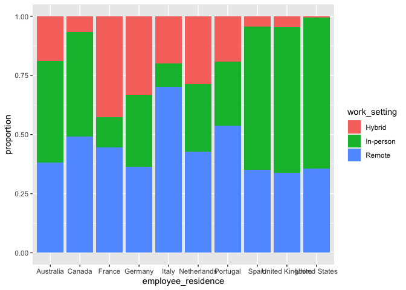

Exploring data science salaries
================
Steven Moran
2024-02-06

``` r
# Load the libraries
library(tidyverse)
library(knitr)
```

# Introduction

In this report we will explore data science salaries. The data come from
Kaggle:

- <https://www.kaggle.com/datasets/ruchi798/data-science-job-salaries>

# Methods

Let’s load the data.

``` r
# Load the CSV file
df <- read_csv('jobs_in_data.csv')

# If you use Excel:
# library(readxl)
# df_excel <- read_excel('jobs_in_data.xls')
```

Let’s get the proportion of work place setting based on country.

``` r
# Create a new table with total number of jobs by country
total_jobs <- df %>% 
  select(employee_residence) %>% 
  group_by(employee_residence) %>% 
  summarize(total_jobs = n())

total_jobs_by_worksetting <- df %>% 
  select(employee_residence, work_setting) %>% 
  group_by(employee_residence, work_setting) %>% 
  summarize(total_jobs_by_worksetting = n())
```

    ## `summarise()` has grouped output by 'employee_residence'. You can override
    ## using the `.groups` argument.

``` r
results <- left_join(total_jobs_by_worksetting, total_jobs)
```

    ## Joining with `by = join_by(employee_residence)`

``` r
results <- results %>% mutate(proportion = total_jobs_by_worksetting / total_jobs)
```

Let’s make a stacked bar plot.

``` r
results_30 <- results %>% filter(total_jobs > 19) 

ggplot(data = results_30, aes(fill = work_setting, x = employee_residence, y = proportion)) + 
 geom_bar(position = "stack", stat = "identity")
```

<!-- -->

What’s the average salary per country.

``` r
mean_salary_countries <- df %>% 
  select(employee_residence, work_setting, salary_in_usd) %>%
  group_by(employee_residence, work_setting) %>%
  summarize(mean_salary = mean(salary_in_usd))
```

    ## `summarise()` has grouped output by 'employee_residence'. You can override
    ## using the `.groups` argument.

``` r
mean_salary_countries %>% arrange(desc(mean_salary), employee_residence)
```

    ## # A tibble: 145 × 3
    ## # Groups:   employee_residence [83]
    ##    employee_residence work_setting mean_salary
    ##    <chr>              <chr>              <dbl>
    ##  1 Qatar              Remote           300000 
    ##  2 Russia             Hybrid           230000 
    ##  3 Australia          In-person        215630.
    ##  4 Japan              In-person        214000 
    ##  5 Malaysia           Remote           200000 
    ##  6 Puerto Rico        Remote           167500 
    ##  7 United States      In-person        160911.
    ##  8 Puerto Rico        Hybrid           160000 
    ##  9 United States      Remote           154688.
    ## 10 Canada             In-person        154085.
    ## # ℹ 135 more rows

``` r
df %>% 
  group_by(employee_residence) %>% 
  summarize(people = n())
```

    ## # A tibble: 83 × 2
    ##    employee_residence     people
    ##    <chr>                   <int>
    ##  1 Algeria                     1
    ##  2 American Samoa              1
    ##  3 Andorra                     1
    ##  4 Argentina                   9
    ##  5 Armenia                     2
    ##  6 Australia                  21
    ##  7 Austria                     6
    ##  8 Belgium                     6
    ##  9 Bolivia                     2
    ## 10 Bosnia and Herzegovina      1
    ## # ℹ 73 more rows

``` r
final <- left_join(results_30, mean_salary_countries)
```

    ## Joining with `by = join_by(employee_residence, work_setting)`

Our final table.

``` r
final %>% kable()
```

| employee_residence | work_setting | total_jobs_by_worksetting | total_jobs | proportion | mean_salary |
|:-------------------|:-------------|--------------------------:|-----------:|-----------:|------------:|
| Australia          | Hybrid       |                         4 |         21 |  0.1904762 |    61324.75 |
| Australia          | In-person    |                         9 |         21 |  0.4285714 |   215630.11 |
| Australia          | Remote       |                         8 |         21 |  0.3809524 |    90681.25 |
| Canada             | Hybrid       |                        15 |        224 |  0.0669643 |   112649.67 |
| Canada             | In-person    |                        99 |        224 |  0.4419643 |   154085.15 |
| Canada             | Remote       |                       110 |        224 |  0.4910714 |   140711.45 |
| France             | Hybrid       |                        23 |         54 |  0.4259259 |    62768.35 |
| France             | In-person    |                         7 |         54 |  0.1296296 |   134375.29 |
| France             | Remote       |                        24 |         54 |  0.4444444 |    82230.96 |
| Germany            | Hybrid       |                        22 |         66 |  0.3333333 |    73471.18 |
| Germany            | In-person    |                        20 |         66 |  0.3030303 |   118712.80 |
| Germany            | Remote       |                        24 |         66 |  0.3636364 |   102235.83 |
| Italy              | Hybrid       |                         4 |         20 |  0.2000000 |    31647.25 |
| Italy              | In-person    |                         2 |         20 |  0.1000000 |    44146.50 |
| Italy              | Remote       |                        14 |         20 |  0.7000000 |    63778.21 |
| Netherlands        | Hybrid       |                         6 |         21 |  0.2857143 |    89908.33 |
| Netherlands        | In-person    |                         6 |         21 |  0.2857143 |    88316.50 |
| Netherlands        | Remote       |                         9 |         21 |  0.4285714 |    62585.56 |
| Portugal           | Hybrid       |                         5 |         26 |  0.1923077 |    38346.40 |
| Portugal           | In-person    |                         7 |         26 |  0.2692308 |    53361.71 |
| Portugal           | Remote       |                        14 |         26 |  0.5384615 |    60010.43 |
| Spain              | Hybrid       |                         5 |        117 |  0.0427350 |    47507.60 |
| Spain              | In-person    |                        71 |        117 |  0.6068376 |    54062.97 |
| Spain              | Remote       |                        41 |        117 |  0.3504274 |    66339.73 |
| United Kingdom     | Hybrid       |                        21 |        442 |  0.0475113 |   105284.90 |
| United Kingdom     | In-person    |                       271 |        442 |  0.6131222 |   107490.05 |
| United Kingdom     | Remote       |                       150 |        442 |  0.3393665 |   100226.59 |
| United States      | Hybrid       |                        40 |       8086 |  0.0049468 |   138567.50 |
| United States      | In-person    |                      5169 |       8086 |  0.6392530 |   160910.61 |
| United States      | Remote       |                      2877 |       8086 |  0.3558001 |   154688.15 |
